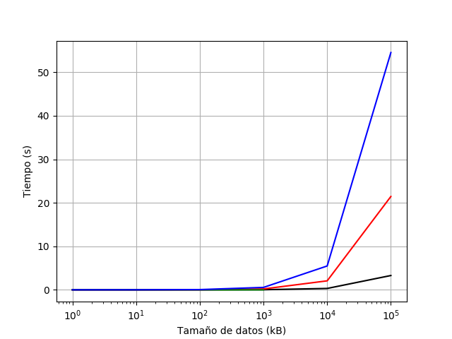

Sergio Alejandro Vargas

Sistemas Operativos

2020-05-20

# Medición de tiempos para diferentes IPC

Hacer una comparación de los diferentes métodos de comunicación entre procesos (IPC)
y graficar los resultados.

1. Implementar los siguientes IPC entre dos procesos:
- Archivos
- memoria compartida
- _pipes_
- _sockets_
2. Probar cada IPC pasando datos de tamaño:
- `  1 kB`
- ` 10 kB`
- `100 kB`
- `  1 MB`
- ` 10 MB`
- `100 MB`

## Entorno

El entorno en el que se hicieron las medidas fue:
- Procesador: Intel core i5 (x86_64)
- OS: Lubuntu 19.10
- Shell: Bash 3.2

## Metodología

Las implementaciones de cada método de comunicación están en el directorio `src/`.
La medida de tiempo se realizó en `test_execution_times.sh`, 
como se ve en el _script_ los resultados fueron escritos a un archivo de texto `times.txt`.

Se copiaron los resultados escritos en `times.txt` a un _script_ de Python para
hacer una gráfica usando la biblioteca Matplotlib.

## Resultados

En la gráfica se muestra los archivos compartidos en negro, los _pipes_ en rojo,
la memoria compartida en verde y los _sockets_ en azul.

Se puede observar que para datos menores que 1 MB,
la diferencia entre cada método es muy pequeña.

También se puede ver que para datos más pesados el método de archivos compartidos
resulta ser el más eficiente, seguido por los _pipes_, y por último los _sockets_.
Sin embargo, el sistema, no permitió hacer la asignación de memoria compartida
para datos de este tamaño, por lo cual la comparación resulta incompleta.

